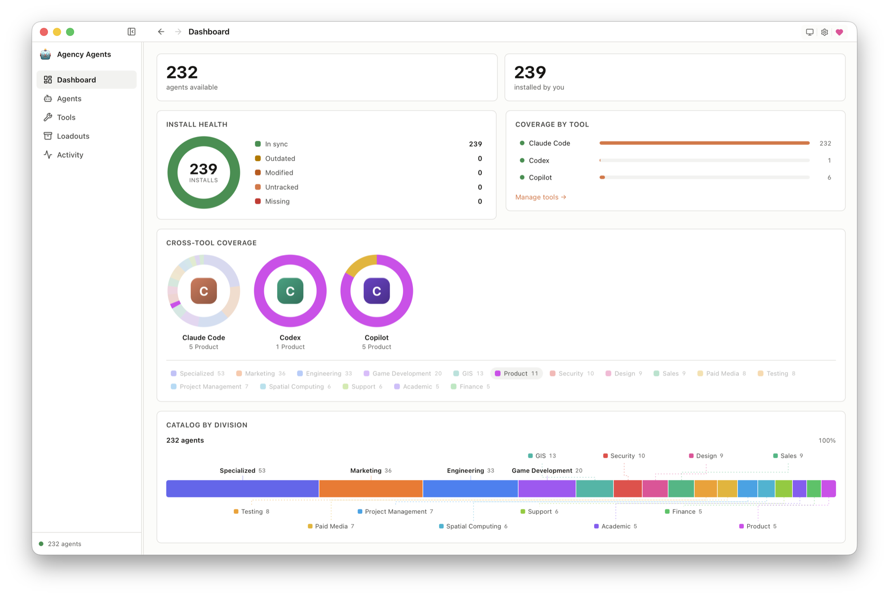

# Agency Agents

> A native installer for AI agents.

[](./LICENSE)
[](https://tauri.app)
[](https://www.apple.com/macos)
[](https://github.com/sponsors/msitarzewski)

Agency Agents is a small, native app for browsing, installing, and tracking the agent personas from [`msitarzewski/agency-agents`](https://github.com/msitarzewski/agency-agents) across the AI coding tools you actually use.

It is full source, MIT-licensed, local-first, and does not run telemetry.

<picture>
  <source media="(prefers-color-scheme: dark)" srcset="landing/screenshots/dashboard-dark.png">
  
</picture>

## Why This Exists

The `agency-agents` repo is a useful catalog of specialist AI agent personas, but every coding tool has its own agent format and install path. Claude Code, Codex, Cursor, Gemini CLI, Qwen, opencode, and Copilot all want similar content in slightly different places.

Agency Agents gives that catalog a native control surface:

- browse the agent catalog by division and role
- inspect the source persona before installing it
- install deterministic renders into supported tools
- track what the app wrote using a local ledger
- detect drift when a file was modified outside the app
- update, remove, or back up installs without guessing

The core idea is simple: AI tools do not share a package database, so the app keeps the local install database they are missing.

## Features

- **Agents workspace** — searchable three-pane catalog, category filters, detail panel, and per-agent deployment controls.
- **Install tracking** — records every app-managed install with source hash, rendered hash, tool, destination, scope, and project path where relevant.
- **Reconciliation** — classifies installed files as current, outdated, modified, removed, or foreign by re-rendering canonical source and comparing bytes.
- **Tools panel** — shows detected tools, installed counts, versions where available, default targets, project installs, and bulk operations.
- **Dashboard** — coverage, health, category distribution, and category-by-tool charts with deep links back into the workspace.
- **Loadouts** — save and restore groups of agents as portable Agentfiles.
- **GitHub integration** — optional OAuth Device Flow for GitHub-backed app features. Tokens are stored in the platform keychain and are never returned to the frontend.
- **Offline-first catalog** — ships with a bundled corpus baseline and can use a local or managed clone of `agency-agents`.
- **Cross-platform shell** — Tauri 2 + Svelte 5 frontend with native macOS chrome and opaque native windows on Windows/Linux.

## Supported Install Targets

The app currently installs to the renderer-backed targets that have deterministic byte parity with the upstream `agency-agents` converter:

| Tool | Scope Today | Output |
|------|-------------|--------|
| Claude Code | user | `~/.claude/agents/*.md` |
| Codex | user | `~/.codex/agents/*.toml` |
| Gemini CLI | user | `~/.gemini/agents/*.md` |
| GitHub Copilot | user | `~/.github/agents/*.md` and `~/.copilot/agents/*.md` |
| Qwen Code | user | `~/.qwen/agents/*.md` |
| Cursor | project | `.cursor/rules/*.mdc` |
| opencode | project | `.opencode/agents/*.md` |

The upstream AA repo also contains integrations for Antigravity, Aider, Windsurf, OpenClaw, and Kimi. Those output shapes need additional app work before they should be exposed as first-class app installs.

## What This Isn't

- Not an agent runtime. The app installs personas into other tools; it does not execute them.
- Not a replacement for the `agency-agents` repo. The repo remains the source catalog.
- Not a telemetry product. There are no analytics SDKs, user tracking, or accounts required for core use.
- Not a shell command bridge. The frontend cannot construct arbitrary shell commands.

## Install

Grab the build for your platform from the [latest release](https://github.com/msitarzewski/agency-agents-app/releases/latest):

- **macOS** (Apple Silicon & Intel) — signed + notarized `.dmg`, macOS 13+.
- **Linux** (x86_64) — `.deb`, `.rpm`, or the portable `.AppImage`.
- **Windows** (x64 & ARM64) — `.exe` installer (not code-signed yet; SmartScreen → *More info → Run anyway*).

Or on macOS via Homebrew:

```sh
brew tap msitarzewski/agency-agents
brew install --cask agency-agents
```

For local review, use the development app:

```sh
npm install
npm run tauri dev
```

For a signed release build on macOS, see [docs/BUILD.md](./docs/BUILD.md).

## Build From Source

Prerequisites:

- [Rust](https://rustup.rs/) stable
- [Node.js 22+](https://nodejs.org/) and npm
- Xcode Command Line Tools on macOS: `xcode-select --install`
- Full Xcode only when regenerating the macOS Liquid Glass icon assets

Then:

```sh
git clone https://github.com/msitarzewski/agency-agents-app
cd agency-agents-app
npm install
npm run tauri dev
npm run check
cargo test --manifest-path src-tauri/Cargo.toml --lib
npm run build
```

The Phase C local QA batch is:

```sh
npm run build:phase-c
```

Use the full VM-assisted batch when the configured Ubuntu/Windows test environments are available:

```sh
npm run build:phase-c:full
```

## Architecture

A Tauri 2 shell hosts a SvelteKit + Svelte 5 frontend in the system WebView. The Rust backend owns the catalog, renderer, install ledger, reconciliation, GitHub integration, settings, and updater boundary.

The catalog comes from `agency-agents`, either as:

- a bundled baseline inside the app
- a managed local clone at `~/.agency-agents`
- a user-selected clone, such as `/Users/michael/Software/AgentLand/agency-agents`

Rendering is native Rust, deterministic, and tested against the upstream `scripts/convert.sh` outputs for the supported transform tools. The app does not shell out to converter scripts at runtime.

Important implementation areas:

- [src-tauri/src/corpus/mod.rs](./src-tauri/src/corpus/mod.rs) — catalog source, indexing, refresh, category discovery
- [src-tauri/src/render/mod.rs](./src-tauri/src/render/mod.rs) — per-tool deterministic rendering and destination paths
- [src-tauri/src/install/mod.rs](./src-tauri/src/install/mod.rs) — install, uninstall, ledger, detection, reconciliation
- [src/lib/components/AgentsWorkspace.svelte](./src/lib/components/AgentsWorkspace.svelte) — main browse/install surface
- [src/lib/components/ToolsView.svelte](./src/lib/components/ToolsView.svelte) — tool status and bulk operations

Memory Bank design context lives under [memory-bank/](./memory-bank/). Start with [memory-bank/projectbrief.md](./memory-bank/projectbrief.md), [memory-bank/systemPatterns.md](./memory-bank/systemPatterns.md), and [memory-bank/NEXT-SESSION.md](./memory-bank/NEXT-SESSION.md).

## Network Posture

Core browsing and install tracking are local. Network access is explicit and gated by Settings.

Known outbound paths:

- GitHub/codeload/raw GitHub endpoints for refreshing the `agency-agents` catalog when the user requests or enables it.
- GitHub OAuth Device Flow when the user chooses to sign in.
- GitHub API calls for optional GitHub-backed app features.
- The app updater manifest and release artifacts when update checks are enabled.

No telemetry, crash reporting, advertising pixels, or product analytics are included.

## Security

Agency Agents uses typed Tauri IPC commands and avoids `tauri-plugin-shell`. File writes are restricted to known install destinations, app state, backups, and user-selected paths. Modified installed files are backed up before destructive operations.

Report vulnerabilities using [SECURITY.md](./SECURITY.md).

## Contributing

Contributions are welcome. See [CONTRIBUTING.md](./CONTRIBUTING.md).

The highest-value areas before 1.0 are:

- verified tool-target manifest shared with the AA repo
- additional project-scope install targets
- multi-file renderer support for Aider, Windsurf, OpenClaw, Antigravity, and Kimi once their target formats are verified
- Windows/Linux packaging validation
- GitHub issue/discussion integrations

## License

[MIT](./LICENSE). Do whatever you want with this.

## Acknowledgments

- [Agency Agents](https://github.com/msitarzewski/agency-agents) — the source catalog and upstream converter/install scripts.
- [Tauri](https://tauri.app) — native app shell without the Electron footprint.
- [Svelte](https://svelte.dev) — the frontend runtime.

## Support The Project

If Agency Agents saves you time, consider [sponsoring on GitHub](https://github.com/sponsors/msitarzewski). Sponsorship is optional and does not unlock a paid tier.
